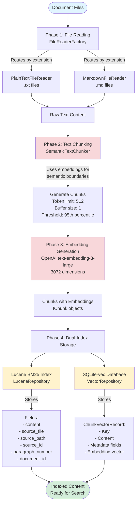
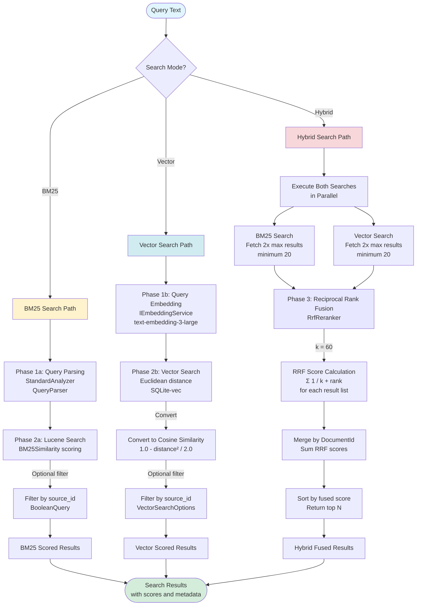

# Pixelbadger.Toolkit.Rag

A CLI toolkit for RAG (Retrieval-Augmented Generation) workflows, providing BM25 and vector similarity search indexing, querying, semantic chunking, and MCP server functionality powered by Lucene.NET and sqlite-vec.

## Table of Contents

- [Installation](#installation)
- [Usage](#usage)
- [Available Commands](#available-commands)
  - [ingest](#ingest)
  - [query](#query)
  - [serve](#serve)
- [MCP Server Integration](#mcp-server-integration)
- [Help](#help)
- [Requirements](#requirements)
- [Technical Details](#technical-details)
  - [BM25 Similarity Search](#bm25-similarity-search)
  - [Content Chunking](#content-chunking)
  - [Index Structure](#index-structure)

## Installation

### Option 1: Install as .NET Global Tool (Recommended)

Install the tool globally using the NuGet package:
```bash
dotnet tool install --global Pixelbadger.Toolkit.Rag
```

Once installed, you can use the `pbrag` command from anywhere:
```bash
pbrag --help
```

### Option 2: Build from Source

Clone the repository and build the project:
```bash
git clone https://github.com/pixelbadger/Pixelbadger.Toolkit.git
cd Pixelbadger.Toolkit/Pixelbadger.Toolkit.Rag
dotnet build
```

## Usage

### Using the Global Tool (pbrag)
Run commands using the flat command pattern:
```bash
pbrag [command] [options]
```

### Using from Source
If building from source, use:
```bash
dotnet run -- [command] [options]
```

## Available Commands

### ingest

Ingest content files into a Lucene.NET search index with intelligent chunking.

**Usage:**
```bash
pbrag ingest --index-path <index-directory> --content-path <content-file>
```

**Options:**
- `--index-path`: Path to the Lucene.NET index directory (required)
- `--content-path`: Path to the content file to ingest (required)
- `--chunking-strategy`: Chunking strategy to use: `semantic`, `markdown`, or `paragraph` (optional, default: auto-detect)
- `--enable-vectors`: Enable vector storage for semantic search (optional, default: false)

**Examples:**
```bash
# Ingest a text document (auto-detect chunking strategy)
pbrag ingest --index-path ./search-index --content-path document.txt

# Ingest a markdown file with explicit markdown chunking
pbrag ingest --index-path ./search-index --content-path readme.md --chunking-strategy markdown

# Ingest with semantic chunking (requires OPENAI_API_KEY environment variable)
export OPENAI_API_KEY="sk-..."
pbrag ingest --index-path ./search-index --content-path document.txt --chunking-strategy semantic

# Ingest with vector storage enabled for semantic search (requires OPENAI_API_KEY environment variable)
export OPENAI_API_KEY="sk-..."
pbrag ingest --index-path ./search-index --content-path document.txt --enable-vectors

# Build an index from multiple files
pbrag ingest --index-path ./search-index --content-path doc1.txt
pbrag ingest --index-path ./search-index --content-path doc2.md
pbrag ingest --index-path ./search-index --content-path doc3.txt
```

**Details:**
- Automatically detects file type and applies appropriate chunking strategy
- Markdown files (.md): Header-based chunking preserving document structure
- Text files (.txt): Paragraph-based chunking splitting on double newlines
- Creates index directory if it doesn't exist
- Appends to existing index, allowing incremental ingestion
- Each chunk is indexed with source file, paragraph number, and unique source ID

### query

Perform BM25 similarity search against a Lucene.NET index to find relevant content.

**Usage:**
```bash
pbrag query --index-path <index-directory> --query <search-query> [--max-results <number>] [--sourceIds <id1> <id2> ...]
```

**Options:**
- `--index-path`: Path to the Lucene.NET index directory (required)
- `--query`: Search query text (required)
- `--max-results`: Maximum number of results to return (optional, default: 10)
- `--sourceIds`: Optional list of source IDs to constrain search results (optional)
- `--search-mode`: Search mode to use: bm25, vector, or hybrid (optional, default: bm25)

**Examples:**
```bash
# Basic search query
pbrag query --index-path ./search-index --query "machine learning algorithms"

# Limit results to top 5
pbrag query --index-path ./search-index --query "neural networks" --max-results 5

# Search within specific source documents
pbrag query --index-path ./search-index --query "data processing" --sourceIds doc1.txt doc2.md

# Complex multi-word query
pbrag query --index-path ./search-index --query "how to implement dependency injection in C#"

# Vector similarity search (requires OPENAI_API_KEY environment variable)
export OPENAI_API_KEY="sk-..."
pbrag query --index-path ./search-index --query "machine learning algorithms" --search-mode vector

# Hybrid search combining BM25 and vector (requires OPENAI_API_KEY environment variable)
pbrag query --index-path ./search-index --query "neural networks" --search-mode hybrid
```

**Output Format:**
```
Found 3 result(s):

Result 1 (Score: 2.4531)
Source: document.txt (Paragraph 5)
Content: Machine learning algorithms are fundamental to modern AI systems...
------------------------------------------------------------
Result 2 (Score: 1.8923)
Source: readme.md (Paragraph 12)
Content: Neural networks represent a class of machine learning models...
------------------------------------------------------------
Result 3 (Score: 1.2451)
Source: guide.txt (Paragraph 3)
Content: The application of algorithms in machine learning has transformed...
```

### serve

Host an MCP (Model Context Protocol) server that performs BM25 queries against a Lucene.NET index, enabling AI assistants to search your indexed content.

**Usage:**
```bash
pbrag serve --index-path <index-directory>
```

**Options:**
- `--index-path`: Path to the Lucene.NET index directory (required)

**Examples:**
```bash
# Start MCP server for an existing index
pbrag serve --index-path ./search-index
```

**Details:**
- Runs as a stdio-based MCP server
- Exposes a search tool that AI assistants can call
- Uses BM25 similarity ranking for relevance
- Supports result filtering by source IDs
- Logs all activity to stderr for monitoring
- Ideal for integration with Claude Desktop or other MCP-compatible clients

## MCP Server Integration

The `serve` command implements the Model Context Protocol (MCP), allowing AI assistants to search your indexed content dynamically during conversations.

### Claude Desktop Configuration

Add the following to your Claude Desktop configuration:

**MacOS:** `~/Library/Application Support/Claude/claude_desktop_config.json`
**Windows:** `%APPDATA%/Claude/claude_desktop_config.json`

```json
{
  "mcpServers": {
    "rag-search": {
      "command": "pbrag",
      "args": ["serve", "--index-path", "/absolute/path/to/your/search-index"]
    }
  }
}
```

### MCP Tool Interface

The server exposes a single tool called `Execute` with the following parameters:

- **query** (required): The search query to be performed
- **maxResults** (optional): Maximum number of results to return (default: 5)
- **sourceIds** (optional): Array of source IDs to constrain search results to specific documents
- **searchMode** (optional): Search mode to use: "bm25", "vector", or "hybrid" (default: "bm25")

When an AI assistant uses this tool, it receives formatted search results including relevance scores, source files, paragraph numbers, and content excerpts.

### Workflow Example

```bash
# Step 1: Ingest your documentation
pbrag ingest --index-path ./docs-index --content-path ./api-docs.md
pbrag ingest --index-path ./docs-index --content-path ./tutorial.md
pbrag ingest --index-path ./docs-index --content-path ./reference.txt

# Step 2: Test queries locally
pbrag query --index-path ./docs-index --query "authentication"

# Step 3: Start MCP server (or configure in Claude Desktop)
pbrag serve --index-path ./docs-index
```

## Help

Get help for any command by adding `--help`:
```bash
pbrag --help                     # General help
pbrag ingest --help              # Command-specific help
pbrag query --help               # Command-specific help
pbrag serve --help               # Command-specific help
```

## Requirements

- .NET 9.0
- Lucene.NET 4.8.0 (beta)
- ModelContextProtocol 0.3.0 (for MCP server functionality)
- Microsoft.Extensions.VectorData.Abstractions 9.7.0 (for vector data abstractions)
- Microsoft.SemanticKernel.Connectors.SqliteVec 1.68.0-preview (for sqlite-vec vector storage)
- Microsoft.Extensions.AI (for embedding generation)

## Architecture Overview

This section provides a detailed overview of the document ingestion and search pipelines, illustrating how documents flow through the system from raw files to searchable indexed content, and how queries are processed to retrieve relevant results.

### Document Ingestion Pipeline

The ingestion pipeline processes documents through four main phases: file reading, text chunking, embedding generation, and dual-index storage.



#### Ingestion Pipeline Phases

**Phase 1: File Reading**
- **Component**: `FileReaderFactory` with `IFileReader` implementations
- **Location**: `Pixelbadger.Toolkit.Rag/Components/FileReaders/`
- **Process**:
  - FileReaderFactory identifies file type by extension
  - Routes files to appropriate reader (PlainTextFileReader for `.txt`, MarkdownFileReader for `.md`)
  - Extracts raw text content from files
  - Supports both single file and folder-based batch ingestion

**Phase 2: Text Chunking**
- **Component**: `SemanticTextChunker` implementing `ITextChunker`
- **Location**: `Pixelbadger.Toolkit.Rag/Components/ITextChunker.cs`
- **Configuration**:
  - Token limit: 512 tokens (default)
  - Buffer size: 1
  - Threshold type: Percentile
  - Threshold amount: 95th percentile
- **Process**:
  - Takes raw text content as input
  - Uses embedding generator to understand semantic boundaries between sentences
  - Creates chunks based on semantic similarity rather than fixed sizes
  - Each sentence is compared to its neighbors to identify natural break points
  - Produces optimal chunks that preserve semantic coherence

**Phase 3: Embedding Generation**
- **Component**: `OpenAIEmbeddingService` with `text-embedding-3-large` model
- **Dimensions**: 3072-dimensional vectors
- **Process**:
  - Generates embeddings for each chunk during the chunking process
  - Embeddings are pre-computed and stored with chunks
  - No re-embedding required during storage or search
  - Requires `OPENAI_API_KEY` environment variable

**Phase 4: Dual-Index Storage**
- **Components**:
  - `LuceneRepository` for BM25 keyword search
  - `VectorRepository` for semantic vector search
- **Storage Locations**:
  - Lucene: `{index-path}/` (FSDirectory structure)
  - Vectors: `{index-path}/vectors.db` (SQLite database)
- **Process**:
  - Both indexing operations run sequentially
  - Filters out empty chunks before storage
  - Uses pre-generated embeddings (no re-computation)
  - Each chunk is stored in both indexes with consistent metadata
- **Lucene Fields**:
  - `content`: Full text content (searchable, stored)
  - `source_file`: Original filename
  - `source_path`: Full file path
  - `source_id`: Unique source identifier
  - `paragraph_number`: Chunk sequence number
  - `document_id`: Unique document identifier
- **Vector Record Structure**:
  - Key: Unique identifier
  - Content: Chunk text
  - Source metadata (file, path, id)
  - ChunkNumber: Sequence number
  - DocumentId: Unique document identifier
  - Embedding: 3072-dimension vector

**Orchestrator**: `SearchIndexer.IngestContentAsync()` and `SearchIndexer.IngestFolderAsync()`

### Search and Retrieval Pipeline

The retrieval pipeline supports three search modes: BM25 keyword search, vector semantic search, and hybrid search combining both strategies with Reciprocal Rank Fusion (RRF).



#### Search Pipeline Phases

**BM25 Search Mode**

*Phase 1a: Query Parsing*
- **Component**: `QueryParser` with `StandardAnalyzer`
- **Location**: `LuceneRepository.QueryLuceneAsync()`
- **Process**:
  - Parses query text using Lucene's QueryParser
  - Applies StandardAnalyzer for tokenization and normalization
  - Generates query against the "content" field
  - Optional: Adds BooleanQuery filter for source_id constraints

*Phase 2a: Lucene Search*
- **Component**: `LuceneRepository` with `BM25Similarity`
- **Process**:
  - Opens Lucene FSDirectory index
  - Executes search with BM25 relevance scoring
  - BM25 considers term frequency, document frequency, and document length
  - Returns scored `SearchResult` objects with metadata
  - Results include: score, content, source file, source path, source id, paragraph number, document id

**Vector Search Mode**

*Phase 1b: Query Embedding*
- **Component**: `IEmbeddingService` with OpenAI `text-embedding-3-large`
- **Location**: `VectorRepository.QueryVectorsAsync()`
- **Process**:
  - Generates 3072-dimension embedding vector for query text
  - Uses same model as document ingestion for consistency
  - Requires `OPENAI_API_KEY` environment variable

*Phase 2b: Vector Similarity Search*
- **Component**: `VectorRepository` with SQLite-vec
- **Process**:
  - Opens SQLite-vec database at `{index-path}/vectors.db`
  - Performs vector similarity search using Euclidean distance
  - Converts Euclidean distance to cosine similarity: `1.0 - (distance² / 2.0)`
  - Optional: Applies source_id filter via VectorSearchOptions
  - Returns scored `SearchResult` objects
  - Results ranked by semantic similarity to query

**Hybrid Search Mode**

*Phase 1-2: Parallel Execution*
- **Process**:
  - Executes both BM25 and Vector searches concurrently
  - Fetches `2 × max_results` from each index (minimum 20 per index)
  - Over-fetching ensures better fusion quality
  - Both searches apply same source_id filters if specified

*Phase 3: Reciprocal Rank Fusion (RRF)*
- **Component**: `RrfReranker`
- **Algorithm**: Reciprocal Rank Fusion with k=60 (standard parameter)
- **Formula**: `RRF_score(doc) = Σ(1 / (k + rank))` across both result lists
- **Process**:
  1. Receives results from both BM25 and Vector searches
  2. Calculates RRF score for each document in each list
  3. Groups results by DocumentId
  4. Sums RRF scores for documents appearing in both lists
  5. Sorts merged results by total RRF score (descending)
  6. Returns top N results as specified by max_results
- **Benefits**:
  - Combines strengths of keyword matching (BM25) and semantic understanding (vectors)
  - Documents appearing in both result sets get higher scores
  - Robust to differences in scoring scales between BM25 and vector search
  - No manual weight tuning required

**Orchestrator**: `SearchIndexer.SearchAsync()`

#### Search Result Output

All search modes return `SearchResult` objects containing:
- **Score**: Relevance score (BM25 score, cosine similarity, or RRF score)
- **Content**: The chunk text content
- **SourceFile**: Original filename
- **SourcePath**: Full file path
- **SourceId**: Unique source identifier
- **ParagraphNumber**: Chunk sequence number
- **DocumentId**: Unique document identifier

## Technical Details

### BM25 Similarity Search
### Vector Similarity Search

Vector similarity search complements BM25 with semantic understanding of content. This implementation:

- Uses OpenAI's `text-embedding-3-large` model (3072 dimensions) for generating embeddings
- Stores embeddings in a sqlite-vec database alongside the Lucene index
- Calculates cosine similarity between query embeddings and stored document embeddings
- Supports three search modes: pure vector search, BM25 keyword search, or hybrid search combining both with Reciprocal Rank Fusion (RRF)
- Requires `OPENAI_API_KEY` environment variable for embedding generation during ingest and queries
- Embeddings are generated during content ingestion and stored persistently for efficient querying
- Enables semantic search that understands meaning and context beyond keyword matching

### Content Chunking
### Index Structure

Each indexed chunk contains the following fields:

- **sourceFile**: Original file path for provenance
- **paragraphNumber**: Sequential chunk number within the source file
- **content**: The actual text content being indexed and searched
- **sourceId**: Unique identifier derived from the file path (used for filtering)

The index uses:
- **StandardAnalyzer**: For robust tokenization and normalization
- **BM25Similarity**: For relevance-based ranking
- **SimpleDirectory**: For persistent on-disk storage
- **Atomic writes**: Index updates are transactional and crash-safe
